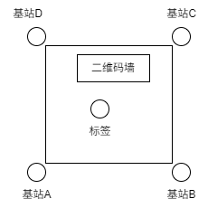

<!-- -*- coding: utf-8 -*- -->
# STM32 解析PGModbus协议并结算标签坐标
## 基站的摆放注意事项
  
基站A是主基站，负责给BCD和标签发送开始测量的信号  
现在我已经将其设置为开机即发送开始测量的信号，因此将东西摆放好之后  
理论上各个基站和标签的串口发送灯就会开始不断闪烁  

## 数学原理
## 1. 问题描述

给定四个基站，其三维空间坐标分别为：

$$
\text{基站}_i: (x_i, y_i, z_i), \quad i = 1, 2, 3, 4
$$

目标点 Ro 的坐标为 \( (x_o, y_o, z_o) \)，目标与各基站的距离为 \( l_i \)，为已知常量（如通过测距传感器或时间转换获得）。

---

## 2. 距离模型

根据欧几里得距离公式：

$$
\sqrt{(x_o - x_i)^2 + (y_o - y_i)^2 + (z_o - z_i)^2} = l_i
$$

平方两边，得到：

$$(x_o - x_i)^2 + (y_o - y_i)^2 + (z_o - z_i)^2 = l_i^2 \tag{1}$$

共有四个方程，但未知数为三个（$x_o, y_o, z_o$），故可通过三个差分线性化方程唯一求解。

---

## 3. 差分线性化

选第一个基站作为参考基站，将其他三个方程分别减去第一个方程，消除二次项中的未知平方：

$$
(x_2^2 - x_1^2) + (y_2^2 - y_1^2) + (z_2^2 - z_1^2) - (l_2^2 - l_1^2) = 2x_o(x_2 - x_1) + 2y_o(y_2 - y_1) + 2z_o(z_2 - z_1)
$$

$$
(x_3^2 - x_1^2) + (y_3^2 - y_1^2) + (z_3^2 - z_1^2) - (l_3^2 - l_1^2) = 2x_o(x_3 - x_1) + 2y_o(y_3 - y_1) + 2z_o(z_3 - z_1)
$$

$$
(x_4^2 - x_1^2) + (y_4^2 - y_1^2) + (z_4^2 - z_1^2) - (l_4^2 - l_1^2) = 2x_o(x_4 - x_1) + 2y_o(y_4 - y_1) + 2z_o(z_4 - z_1)
$$

两边同时除以2，得到标准线性方程组：

---

## 4. 矩阵表示

设：

- 系数矩阵：

$$
A = \begin{bmatrix}
x_2 - x_1 & y_2 - y_1 & z_2 - z_1 \\
x_3 - x_1 & y_3 - y_1 & z_3 - z_1 \\
x_4 - x_1 & y_4 - y_1 & z_4 - z_1
\end{bmatrix}
$$

- 常数列向量：

$$
b = \frac{1}{2}
\begin{bmatrix}
(x_2^2 - x_1^2) + (y_2^2 - y_1^2) + (z_2^2 - z_1^2) - (l_2^2 - l_1^2) \\
(x_3^2 - x_1^2) + (y_3^2 - y_1^2) + (z_3^2 - z_1^2) - (l_3^2 - l_1^2) \\
(x_4^2 - x_1^2) + (y_4^2 - y_1^2) + (z_4^2 - z_1^2) - (l_4^2 - l_1^2)
\end{bmatrix}
$$

- 未知向量：

$$
X = \begin{bmatrix} x_o \\ y_o \\ z_o \end{bmatrix}
$$

最终线性方程组为：

$$
A X = b
$$

---

## 5. 求解方法

### 克拉默法则（适用于 3×3 系数矩阵）（MCU）

计算三个行列式：

$$
x_o = \frac{\det(A_x)}{\det(A)}, \quad
y_o = \frac{\det(A_y)}{\det(A)}, \quad
z_o = \frac{\det(A_z)}{\det(A)}
$$

## stm32标准库代码
```
typedef struct {
    double x;
    double y;
    double z;
} Vector3d;

// Structure for the UWB solver
typedef struct {
    double A[3][3];      // Matrix A
    double b_tmp[3];     // Temporary b vector for calculations
} UWBSolver;

// Function to calculate the determinant of a 3x3 matrix
double determinant3x3(double matrix[3][3]) {
    return matrix[0][0] * (matrix[1][1] * matrix[2][2] - matrix[1][2] * matrix[2][1]) -
           matrix[0][1] * (matrix[1][0] * matrix[2][2] - matrix[1][2] * matrix[2][0]) +
           matrix[0][2] * (matrix[1][0] * matrix[2][1] - matrix[1][1] * matrix[2][0]);
}

// Function to subtract two vectors
Vector3d vector_subtract(Vector3d a, Vector3d b) {
    Vector3d result = {a.x - b.x, a.y - b.y, a.z - b.z};
    return result;
}

// Function to calculate the cross product of two vectors
Vector3d cross_product(Vector3d a, Vector3d b) {
    Vector3d result = {
        a.y * b.z - a.z * b.y,
        a.z * b.x - a.x * b.z,
        a.x * b.y - a.y * b.x
    };
    return result;
}

// Function to calculate the dot product of two vectors
double dot_product(Vector3d a, Vector3d b) {
    return a.x * b.x + a.y * b.y + a.z * b.z;
}

// Initialize the UWB solver
bool uwb_solver_init(UWBSolver* solver, Vector3d anchors[], int num_anchors, double coplanar_threshold) {
    if (num_anchors != 4) {
        //printf("Error: The number of anchors must be 4.\n");
        return false;
    }

    // Check if the anchors are coplanar
    Vector3d v1 = vector_subtract(anchors[1], anchors[0]);
    Vector3d v2 = vector_subtract(anchors[2], anchors[0]);
    Vector3d v3 = vector_subtract(anchors[3], anchors[0]);
    Vector3d normal = cross_product(v1, v2);
    
    if (fabs(dot_product(normal, v3)) < coplanar_threshold) {
        //printf("Error: The anchors are coplanar.\n");
        return false;
    }

    // Build matrix A
    solver->A[0][0] = anchors[1].x - anchors[0].x;
    solver->A[0][1] = anchors[1].y - anchors[0].y;
    solver->A[0][2] = anchors[1].z - anchors[0].z;
    
    solver->A[1][0] = anchors[2].x - anchors[0].x;
    solver->A[1][1] = anchors[2].y - anchors[0].y;
    solver->A[1][2] = anchors[2].z - anchors[0].z;
    
    solver->A[2][0] = anchors[3].x - anchors[0].x;
    solver->A[2][1] = anchors[3].y - anchors[0].y;
    solver->A[2][2] = anchors[3].z - anchors[0].z;

    // Check if the matrix is invertible
    double det = determinant3x3(solver->A);
    if (fabs(det) < 1e-8) {
        //printf("Error: Matrix A is near-singular or singular. Cannot compute inverse.\n");
        return false;
    }

    // Calculate b_tmp
    solver->b_tmp[0] = (anchors[1].x * anchors[1].x - anchors[0].x * anchors[0].x +
                       anchors[1].y * anchors[1].y - anchors[0].y * anchors[0].y +
                       anchors[1].z * anchors[1].z - anchors[0].z * anchors[0].z) / 2.0;
    
    solver->b_tmp[1] = (anchors[2].x * anchors[2].x - anchors[0].x * anchors[0].x +
                       anchors[2].y * anchors[2].y - anchors[0].y * anchors[0].y +
                       anchors[2].z * anchors[2].z - anchors[0].z * anchors[0].z) / 2.0;
    
    solver->b_tmp[2] = (anchors[3].x * anchors[3].x - anchors[0].x * anchors[0].x +
                       anchors[3].y * anchors[3].y - anchors[0].y * anchors[0].y +
                       anchors[3].z * anchors[3].z - anchors[0].z * anchors[0].z) / 2.0;
    
    //printf("uwb_solver init success\n");
    return true;
}

Vector3d uwb_solver_solve(UWBSolver* solver, double distances[4]) {
    // Calculate b
    double b[3];
    b[0] = solver->b_tmp[0] - (distances[1] * distances[1] - distances[0] * distances[0]) / 2.0;
    b[1] = solver->b_tmp[1] - (distances[2] * distances[2] - distances[0] * distances[0]) / 2.0;
    b[2] = solver->b_tmp[2] - (distances[3] * distances[3] - distances[0] * distances[0]) / 2.0;

    // Calculate det(A)
    double detA = determinant3x3(solver->A);
    
    // Create matrices Ax, Ay, Az by replacing columns with b
    double Ax[3][3], Ay[3][3], Az[3][3];
    
    // Copy A to Ax, Ay, Az
    for (int i = 0; i < 3; i++) {
        for (int j = 0; j < 3; j++) {
            Ax[i][j] = solver->A[i][j];
            Ay[i][j] = solver->A[i][j];
            Az[i][j] = solver->A[i][j];
        }
    }
    
    // Replace columns with b
    for (int i = 0; i < 3; i++) {
        Ax[i][0] = b[i]; // Replace first column with b
        Ay[i][1] = b[i]; // Replace second column with b
        Az[i][2] = b[i]; // Replace third column with b
    }
    
    // Calculate determinants
    double detAx = determinant3x3(Ax);
    double detAy = determinant3x3(Ay);
    double detAz = determinant3x3(Az);
    
    // Apply Cramer's rule
    Vector3d position = {
        detAx / detA,
        detAy / detA,
        detAz / detA
    };
    
    return position;
}
```
以上是根据和基站的四个距离解算标签位置的相关代码，代码工程里面的其他为解析PGModbus的代码

## 解析流程和最有用的变量和函数
首先在main.c里里面开启各个设备的初始化，我们需要知道的就是
```
Usartx_Init(USART1,115200,72);
MODBUS(usart1_rx_buf, usart1_rx_length);
```
前者是表示负责发送和接受的串口是USART1，波特率是115200。  
后者是解析Modbus协议的主要函数，传入的是usart1的缓冲区和长度  
然后我们进入Modbus解析函数
其中我们主要看解析帧格式的主要代码
```
if(recv_buffer[index] != MODBUS_ID || recv_buffer[index + 1] != 0x03)  //modbusid或功能码
			{
				index++;			//解析下一位
				continue;
			}
```
这里可以看出帧头是固定的id和功能码

```
recv_length = recv_buffer[index + 2] + 5;
```
这个是寄存器的长度，大多是时候不需要管

```
crc = CRC_Calculate(&recv_buffer[index], recv_length - 2);
if(recv_buffer[recv_length - 2 + index] != (crc / 256) || recv_buffer[recv_length - 1 + index] != (crc % 256)) 
			{
				index += recv_length;
				continue;
			}
```
然后是数据帧的crc校验，这个是在数据帧的最后两位

```
uint16_t read_idx = index + 3;
			else if(recv_buffer[read_idx] == 0xAC && recv_buffer[read_idx + 1] == 0xDA)	
			{
				Tag_Resolve_OutputStr(recv_buffer,length,read_idx);
			}
```
然后进入解析tag的串口输出帧的数据段，是从第四位开始的

然后我们进入解析函数
```
for(int i = 0;i < ANCHOR_LIST_COUNT; i++)
		{
			if((Last_cal_data_hds.Cal_Flag>>i)&0x01)
			{
				Last_cal_data_hds.Dist[i] = recv_buffer[i * 2 + read_idx] << 8 | recv_buffer[i * 2 + 1 + read_idx];
			}
			else
			{
				Last_cal_data_hds.Dist[i] = 0;
			}
        }
```
这里将每个距离数据的高八位和第八位合在一起最后赋值给Last_cal_data_hds.Dist[i]，如果没有距离数据就赋值成0.  
需要注意的是，源码里面虽然有定位信息的xyz数据的赋值，但是实测数据为0，故目前没用。  
然后就是将距离数据解析到坐标数据  
```
Vector3d anchors[4] = {
        {0.0, 0.0, 160.5},   // Anchor 0
        {358.83, -2.72, 131.8},   // Anchor 1
        {337.0, 679.7, 193.0},   // Anchor 2
        {-261.0, 556.9, 173.0}    // Anchor 3
    };
	double distances[4] = {now_data->Dist[0], now_data->Dist[1], now_data->Dist[2], now_data->Dist[3]};
	UWBSolver solver;
	Vector3d position;
	memset(Tag_ouput_dist_str,0,sizeof(Tag_ouput_dist_str));
	if (uwb_solver_init(&solver, anchors, 4, 1e-6)) {
        position = uwb_solver_solve(&solver, distances);
        //sprintf(dist_str,"Calculated position: x=%f, y=%f, z=%f\n", position.x, position.y, position.z);
    }
```
初始化并调用我的计算函数计算出pos结果   
在实际使用中，需要做的事就是把实际放置的基站的四个坐标，按照cm为单位输入到设定的变量中。

```
	double pos[4];
	pos[0] = position.x / 100.0;
	pos[1] = position.y / 100.0;
	pos[2] = position.z / 100.0;
	pos[3] = 0.0;

    sprintf(dist_str,"Anc%c: %lf  m , ",0x41 + i, pos[i]);
```
这里只是方便我输出串口检查数据是否正常  
最后的结果是
```
strcat(Tag_ouput_dist_str, dist_str);

Usart1_SendString((unsigned char*)Tag_ouput_dist_str,strlen((const char*)Tag_ouput_dist_str));
```
然后就结束了